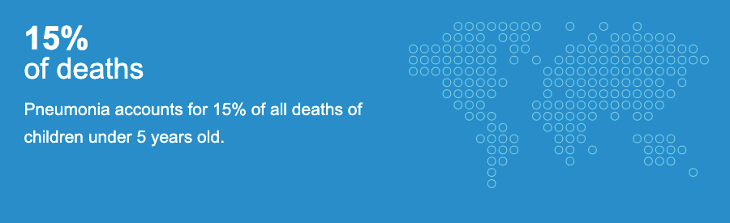

# Module 4 Final Project - Image Classification with Deep Learning

## Business Case and Project Purpose

### What is Pneumonia?
Pneumonia is an acute respiratory infection affecting the tiny air sacs in the lungs, called alveoli. When a patient has pneumonia, these air sacs get swollen (inflamed) and fill with fluid making it harder for them to breathe, even painful, and limits oxygen intake.


More people get pneumonia in winter. This is because respiratory viral infections that spread easily from person to person, such as flu, are more common in the winter, and these increase the risk of developing pneumonia. Most people with pneumonia can be completely cured, but it can be life-threatening particularly for people in "high risk" groups such as:

* babies and very young children
* elderly people
* people who smoke
* people with other health conditions, such as asthma, cystic fibrosis, or a heart, kidney or liver condition
* people with a weakened immune system – for example, as a result of a recent illness, such as flu, having HIV or AIDS, having chemotherapy, or taking medicine after an organ transplant

**According to the <a href="https://www.who.int/health-topics/pneumonia#tab=tab_1" target="_new">World Health Organisation</a>, pneumonia is the single largest infectious cause of death in children worldwide.**


### What causes Pneumonia?

Many kinds of bacteria and viruses can cause pneumonia including coronavirus (COVID-19).

The most common type of pneumonia is **community-acquired pneumonia**, which is when pneumonia affects somebody who is not already in hospital. The most common cause of community-acquired pneumonia is a bacterium called Streptococcus pneumoniae but there are many other causes.

Other types include:

* **viral pneumonia** – caused by a virus, such as coronavirus
* **aspiration pneumonia** – caused by breathing in vomit, a foreign object, such as a peanut, or a harmful substance, such as smoke or a chemical
* **fungal pneumonia** – rare in the UK and more likely to affect people with a weakened immune system
* **hospital-acquired pneumonia** – pneumonia that develops in hospital while being treated for another condition or having an operation; people in intensive care on breathing machines are particularly at risk of developing ventilator-associated pneumonia 

There are two types of vaccine available for pneumonia. They protect against the most common cause of pneumonia, the bacterium Streptococcus pneumoniae.


### Diagnosing Pneumonia

Community-acquired pneumonia can be difficult to diagnose because it shares many symptoms with other conditions, such as the common cold, bronchitis and asthma.

A doctor may be able to diagnose pneumonia by asking about the patient's symptoms and examining their chest but a chest X-ray is often required to confirm the presence of pneumonia.

The clinical judgement of health professionals in diagnosing pneumonia in primary care has been studied. One study demonstrated that GPs’ clinical judgement had a negative predictive value (correctly ruling out pneumonia) of 96%, but a sensitivity (diagnosis after history and physical examination) of only 29%; meaning 71% of pneumonias evident on X-ray had not been suspected clinically (Van Vugt et al, 2013). The study highlighted that health professionals needed additional support to be able to consistently detect pneumonia in primary care.


### Brief


Use Data Science and deep learning techniques to build a model that can classify whether a given child has pneumonia, given a chest x-ray image.

Treatment of patients with bacterial pneumonia can be managed using antibiotics but the speed of intervention is important in ensuring a successful outcome. In the UK, if the patient has been admitted to hospital, treatment should be administered within 4 hours of admission.

Clearly the intention of the final model would not be to replace the expertise of the doctor but instead to augment, assist and speed up the prioritisation and treatment of patients with pneumonia. 

The model might also have application in locations where experienced doctors or radiological examiners are not necessarily immediately available and there may be delays in getting the x-ray analysed.  This may also facilitate the treatment of patients at a community level rather than requiring longer term and expensive hospitalisation.


## The Dataset

The Jupyter notebook uses x-ray images of paediatric patients to identify whether or not they have pneumonia. The dataset comes from Kermany et al. on <a href="https://data.mendeley.com/datasets/rscbjbr9sj/3" target="_new">Mendeley</a> but, for ease of use, we are using a version of the dataset from <a href="https://www.kaggle.com/paultimothymooney/chest-xray-pneumonia" target="_new">Kaggle</a> which has already been organised into train, test and val subsets.

**IMPORTANT NOTE:**

The source images used by the Jupyter notebook have not been included in this GitHub repository and will need to be downloaded and stored in a folder entitled `chest_xray` within the local repository using the folder structure below for the code to run correctly:

```
└── chest_xray

    ├── test                 
        # Raw "test" set of x-ray images of paediatric patients organised into two
        subfolders of normal and pneumonia images.
        
        ├── NORMAL
        └── PNEUMONIA

    ├── train
        # Raw "training" set of x-ray images of paediatric patients organised into two
        subfolders of normal and pneumonia images.

        ├── NORMAL
        └── PNEUMONIA          

    └── val                 
        # Raw "validation" set of x-ray images of paediatric patients organised into two
        subfolders of normal and pneumonia images.

        ├── NORMAL
        └── PNEUMONIA     
```

## Repository Overview

```
index.ipynb             
# Jupyter notebook containing code for data discovery, EDA and a number of deep learning
image classifier models, with improving accuracy, that aim to predict whether an unseen 
paediatric x-ray image has pneumonia or not.

notebook.pdf
# A PDF version of the Jupyter notebook abov.

presentation.pdf
# A non-technical presentation of the project findings.


└── images
    ├── diagram_lungs_pulmonary_fibrosis.png
    ├── kaggle_dataset.png
    └── who_pneumonia_stats.png

```

## Approach

As outlined in the [Jupyter Notebook](index.ipynb) included in this repository, the approach constituted four main parts:

1. The **[Business Case and Project Purpose](index.pynb#business-case)**.

2. Initial **[Exploratory Data Analysis](index.pynb#eda)** to review, quantify and validate the image data available in each of the `train`, `test` and `val` folders.  This section also includes some steps to prepare the data for modelling such as rescaling RGB values and resizing images to 128px x 128px.

3. The creation, refinement through iteration, validation and evaluation of **[Deep Learning Neural Network Models](index.ipynb#deep-learning-neural-networks)** that can classify whether a given paediatric patient has pneumonia, given a chest x-ray image.

4. **[Final Model Performance Evaluation](index.ipynb#final-model-performance-evaluation)**.

## Conclusions

The [Jupyter Notebook](index.ipynb#deep-learning-neural-networks) contains the details of each model using different parameters and structures to improve the overall accuracy of predicted values against unseen data.

Initial models did not generalise well and tended to overfit the training data. Subsequent changes to parameters had little or no effect with significant fluctuations in accuracy against validation data observed.

Augmentation of the training data by flipping the x-ray images vertically struck a better balance between training and validation accuracy.

The final model using a Convolutional Neural Network and data augmentation produced the best results classifying 85% of the “unseen” chest x-ray images, but there is a significant resource overhead when using, taking over an hour to train the model.

## Requisite Python Libraries

The following python libraries have been used as part of this project:

* [Pandas](https://pandas.pydata.org/)
* [NumPy](https://numpy.org/)
* [Matplotlib](https://matplotlib.org/)
* [Seaborn](https://seaborn.pydata.org/)
* [os](https://docs.python.org/3/library/os.html)
* [time](https://docs.python.org/3/library/time.html)
* [keras](https://keras.io/)
* [scikit-learn](https://scikit-learn.org/)
* [SciPy](https://www.scipy.org/)