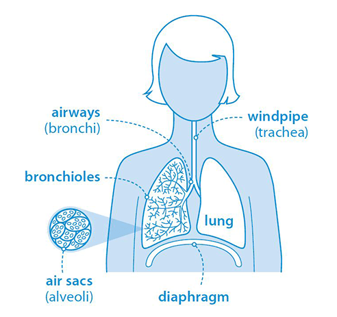

# Module 4 Final Project - Image Classification with Deep Learning

## Business Case and Project Purpose

### 1A. What is Pneumonia?
Pneumonia is an acute respiratory infection affecting the tiny air sacs in the lungs, called alveoli. When a patient has pneumonia, these air sacs get swollen (inflamed) and fill with fluid making it harder for them to breathe, even painful, and limits oxygen intake.

More people get pneumonia in winter. This is because respiratory viral infections that spread easily from person to person, such as flu, are more common in the winter, and these increase the risk of developing pneumonia. Most people with pneumonia can be completely cured, but it can be life-threatening particularly for people in "high risk" groups such as:

* babies and very young children
* elderly people
* people who smoke
* people with other health conditions, such as asthma, cystic fibrosis, or a heart, kidney or liver condition
* people with a weakened immune system – for example, as a result of a recent illness, such as flu, having HIV or AIDS, having chemotherapy, or taking medicine after an organ transplant

**According to the <a href="https://www.who.int/health-topics/pneumonia#tab=tab_1" target="_new">World Health Organisation</a>, pneumonia is the single largest infectious cause of death in children worldwide.**

### Brief

Use Data Science and deep learning techniques to build a model that can classify whether a given child has pneumonia, given a chest x-ray image.

Treatment of patients with bacterial pneumonia can be managed using antibiotics but the speed of intervention is important in ensuring a successful outcome. In the UK, if the patient has been admitted to hospital, treatment should be administered within 4 hours of admission.

Clearly the intention of the final model would not be to replace the expertise of the doctor but instead to augment, assist and speed up the prioritisation and treatment of patients with pneumonia. 

The model might also have application in locations where experienced doctors or radiological examiners are not necessarily immediately available and there may be delays in getting the x-ray analysed.  This may also facilitate the treatment of patients at a community level rather than requiring longer term and expensive hospitalisation.

## Repository Overview

## Approach

## Conclusions

## Requisite Python Libraries

The following python libraries have been used as part of this project:

* [Pandas](https://pandas.pydata.org/)
* [NumPy](https://numpy.org/)
* [Seaborn](https://seaborn.pydata.org/)
* [Matplotlib](https://matplotlib.org/)
* [Squarify](https://github.com/laserson/squarify) (`pip install squarify` to install)
* [Folium](https://python-visualization.github.io/folium/)
* [JSON](https://docs.python.org/3/library/json.html)
* [scikit-learn](https://scikit-learn.org/)
* [statsmodels](https://www.statsmodels.org/stable/index.html)
* [SciPy](https://www.scipy.org/)
* [XGBoost](https://xgboost.readthedocs.io/en/latest/)